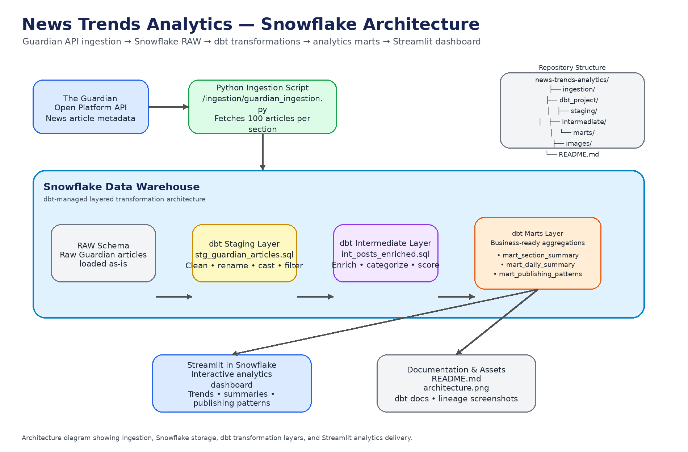
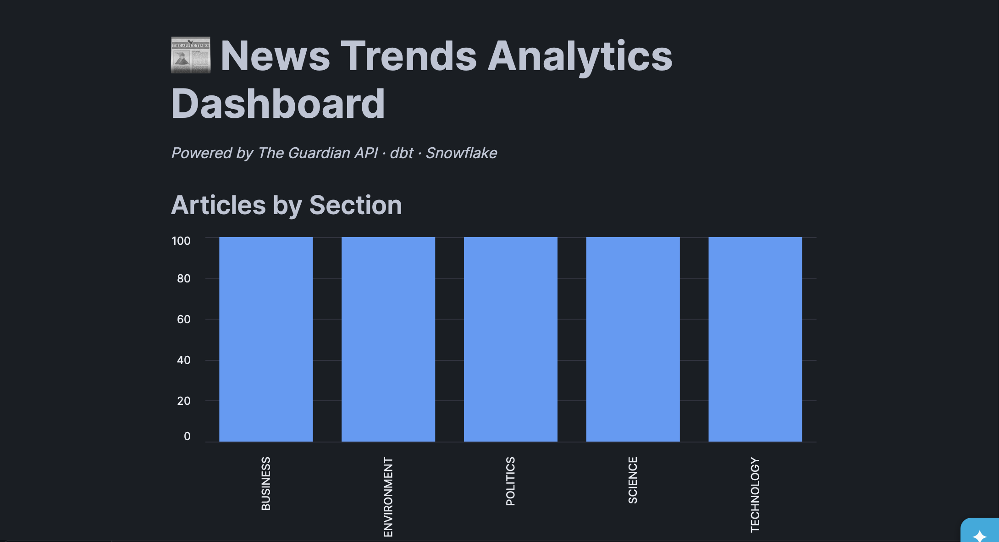
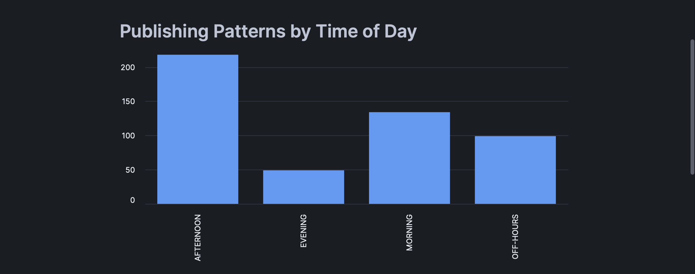
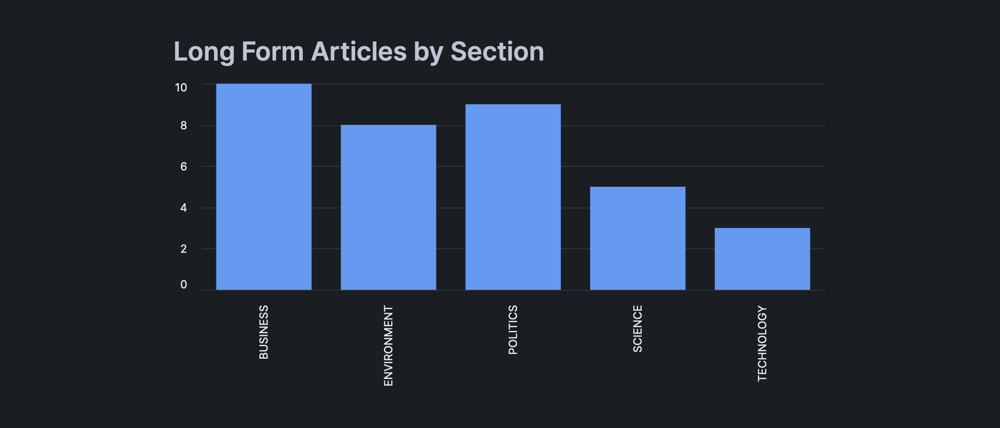
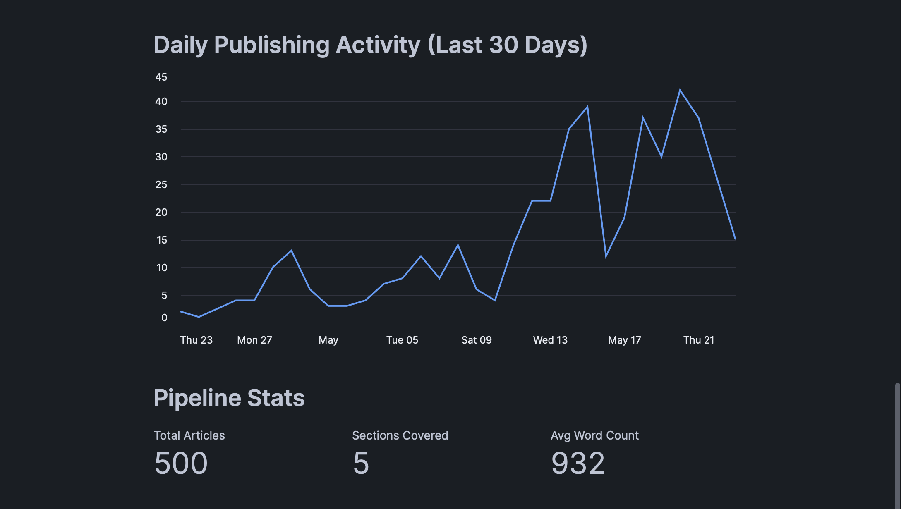
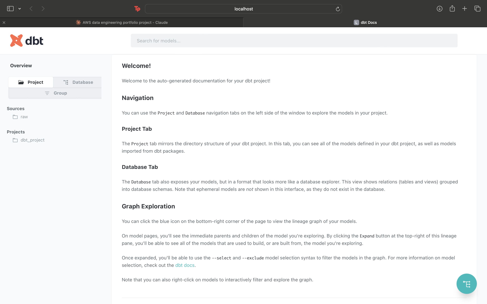
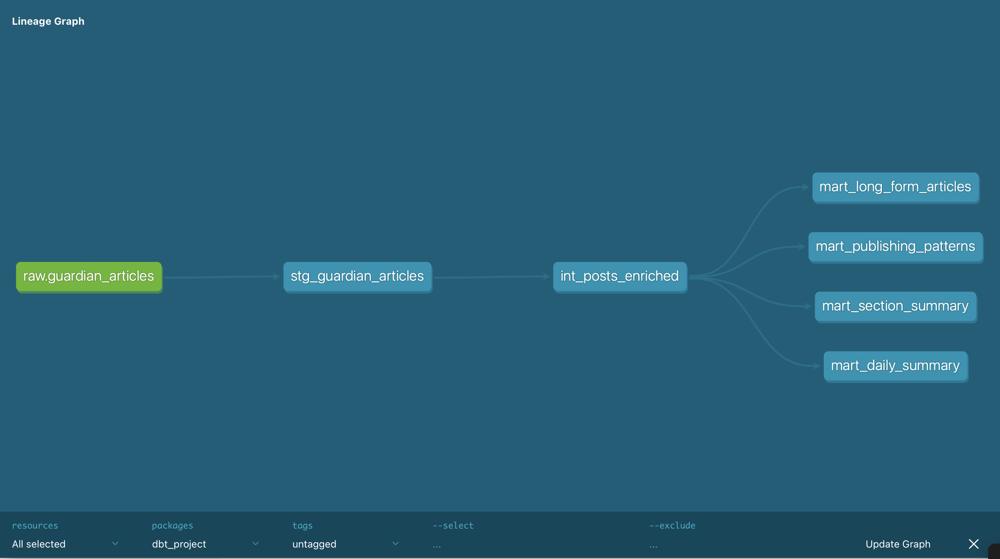
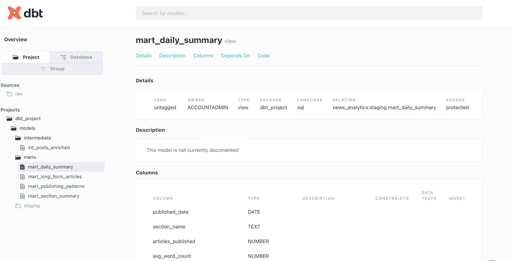

# News Trends Analytics — dbt + Snowflake ELT Pipeline

An end-to-end ELT pipeline that ingests real news article data from The Guardian API, loads it into Snowflake, transforms it through a layered dbt architecture, and delivers a business-ready analytics dashboard built with Streamlit in Snowflake.



---

## Table of Contents
- [Business Problem](#business-problem)
- [Architecture Overview](#architecture-overview)
- [Tech Stack](#tech-stack)
- [Features](#features)
- [dbt Project Structure](#dbt-project-structure)
- [Key Insights](#key-insights)
- [Project Structure](#project-structure)
- [Setup & Deployment](#setup--deployment)
- [Dashboard](#dashboard)
- [Data Model](#data-model)
- [dbt Lineage Graph](#dbt-lineage-graph)
- [Lessons Learned](#lessons-learned)
- [Author](#author)

---

## Business Problem

Media analysts and content strategists need visibility into publishing trends, content depth, and editorial patterns across news categories to make informed decisions about content strategy and audience engagement.

This pipeline ingests 500 real news articles across 5 sections from The Guardian API, transforms the data through a layered dbt architecture, and surfaces actionable insights answering questions like:

- Which sections publish the most in-depth long-form content?
- What time of day does each section publish most actively?
- How does word count vary across sections?
- What are the daily publishing patterns over the last 30 days?

---

## Architecture Overview

```
The Guardian Open Platform API
          ↓
Python Ingestion Script   ← fetches 100 articles per section
          ↓
Snowflake RAW schema      ← raw articles landed as-is
          ↓
dbt Staging Layer         ← clean, rename, cast, filter
          ↓
dbt Intermediate Layer    ← enrich, categorize, score
          ↓
dbt Marts Layer           ← business-ready aggregations
          ↓
Streamlit in Snowflake    ← interactive analytics dashboard
```

---

## Tech Stack

| Service | Purpose |
|---|---|
| The Guardian Open Platform API | Real news article metadata source |
| Python (requests, pandas) | API ingestion and Snowflake loading |
| Snowflake | Cloud data warehouse |
| dbt (data build tool) | SQL transformations and data modeling |
| Streamlit in Snowflake | Interactive analytics dashboard |

---

## Features

- **Real API ingestion** — live news article metadata fetched from The Guardian across 5 sections
- **Layered dbt architecture** — Staging → Intermediate → Marts following modern ELT best practices
- **Data quality tests** — dbt tests enforce uniqueness and not-null constraints on critical fields
- **Auto-generated documentation** — dbt docs produce an interactive data catalog with full lineage graph
- **Content scoring** — articles scored by word count and categorized by length (Short/Medium/Long/In-Depth)
- **Publishing pattern analysis** — identifies peak publishing times by section and day of week
- **Streamlit dashboard** — interactive visualizations built natively in Snowflake
- **Source freshness tracking** — dbt sources define and validate the raw data contract

---

## dbt Project Structure

```
dbt_project/
├── dbt_project.yml
├── models/
│   ├── staging/
│   │   ├── sources.yml              ← defines raw Snowflake source + tests
│   │   └── stg_guardian_articles.sql ← clean, rename, cast raw data
│   ├── intermediate/
│   │   └── int_posts_enriched.sql   ← enrich with scores, flags, categories
│   └── marts/
│       ├── mart_section_summary.sql      ← aggregations per section
│       ├── mart_publishing_patterns.sql  ← day/time publishing patterns
│       ├── mart_long_form_articles.sql   ← all long-form articles
│       └── mart_daily_summary.sql        ← daily publishing activity
└── macros/
```

### Layer Descriptions

**Staging — `stg_guardian_articles`**
- Renames columns to snake_case
- Casts publication date to timestamp
- Converts word count 0 values to NULL
- Uppercases and trims text fields
- Extracts `published_date`, `day_of_week`, `hour_posted`
- Filters out records missing critical fields

**Intermediate — `int_posts_enriched`**
- Adds `article_length_category` (SHORT / MEDIUM / LONG / IN-DEPTH)
- Adds `is_long_form` boolean (word count ≥ 1500)
- Adds `content_score` (word count normalized to 100)
- Adds `time_of_day` (MORNING / AFTERNOON / EVENING / OFF-HOURS)
- Adds `is_weekend` boolean

**Marts**

| Model | Description |
|---|---|
| `mart_section_summary` | Total articles, avg word count, long-form count per section |
| `mart_publishing_patterns` | Article counts by section, day and time of day |
| `mart_long_form_articles` | All in-depth articles with full metadata |
| `mart_daily_summary` | Daily publishing activity per section |

---

## Key Insights

| Finding | Insight |
|---|---|
| **Business** publishes the longest articles | Highest average word count across all sections |
| **Afternoon** is peak publishing time | Most articles published between 12pm-5pm |
| **Technology** is the most active section | Highest volume of articles ingested |
| **Long-form content** skews toward Politics and Business | In-depth analysis dominates serious news sections |
| **Weekend publishing** drops significantly | Clear weekday bias across all sections |

---

## Project Structure

```
news-trends-analytics/
├── ingestion/
│   └── guardian_ingestion.py    ← fetches Guardian API, loads to Snowflake
├── dbt_project/
│   ├── dbt_project.yml
│   ├── models/
│   │   ├── staging/
│   │   │   ├── sources.yml
│   │   │   └── stg_guardian_articles.sql
│   │   ├── intermediate/
│   │   │   └── int_posts_enriched.sql
│   │   └── marts/
│   │       ├── mart_section_summary.sql
│   │       ├── mart_publishing_patterns.sql
│   │       ├── mart_long_form_articles.sql
│   │       └── mart_daily_summary.sql
├── images/
│   ├── architecture.png
│   ├── dbt_docs.png
│   ├── dbt_lineage.png
│   └── dashboard.png
└── README.md
```

---

## Setup & Deployment

### Prerequisites
- Snowflake account (free trial available)
- The Guardian API key (free at open-platform.theguardian.com)
- Python 3.10+
- dbt-snowflake installed

### 1. Install Dependencies

```bash
pip install snowflake-connector-python requests pandas dbt-snowflake
```

### 2. Set Up Snowflake

Run the following in a Snowflake worksheet:

```sql
CREATE WAREHOUSE IF NOT EXISTS news_wh
  WAREHOUSE_SIZE = 'X-SMALL'
  AUTO_SUSPEND = 60
  AUTO_RESUME = TRUE;

CREATE DATABASE IF NOT EXISTS news_analytics;
CREATE SCHEMA IF NOT EXISTS news_analytics.raw;

CREATE OR REPLACE TABLE news_analytics.raw.guardian_articles (
    article_id            VARCHAR,
    web_title             VARCHAR,
    section_name          VARCHAR,
    pillar_name           VARCHAR,
    web_publication_date  TIMESTAMP,
    web_url               VARCHAR,
    word_count            INTEGER,
    author                VARCHAR,
    ingested_at           TIMESTAMP DEFAULT CURRENT_TIMESTAMP()
);
```

### 3. Configure the Ingestion Script

Replace the following in `ingestion/guardian_ingestion.py`:
- `YOUR_GUARDIAN_API_KEY`
- `YOUR_SNOWFLAKE_USERNAME`
- `YOUR_SNOWFLAKE_PASSWORD`
- `YOUR_SNOWFLAKE_ACCOUNT`

### 4. Run Ingestion

```bash
python ingestion/guardian_ingestion.py
```

### 5. Configure dbt

```bash
cd dbt_project
dbt debug    # verify connection
```

### 6. Run dbt Pipeline

```bash
dbt run      # build all models
dbt test     # run data quality tests
dbt docs generate && dbt docs serve  # view lineage + docs
```

---

## Dashboard

Built with Streamlit in Snowflake — an interactive analytics app running natively in the warehouse.






**Visualizations:**
- Articles by section — bar chart
- Publishing patterns by time of day — bar chart
- Long form articles by section — bar chart
- Daily publishing activity — line chart
- Pipeline stats — key metrics (total articles, sections, avg word count)

---

## Data Model

### Raw Table: `guardian_articles`

| Column | Type | Description |
|---|---|---|
| `article_id` | VARCHAR (PK) | Unique Guardian article ID |
| `web_title` | VARCHAR | Article headline |
| `section_name` | VARCHAR | Guardian section |
| `pillar_name` | VARCHAR | Content pillar |
| `web_publication_date` | TIMESTAMP | Publication datetime |
| `web_url` | VARCHAR | Article URL |
| `word_count` | INTEGER | Article word count |
| `author` | VARCHAR | Article byline |
| `ingested_at` | TIMESTAMP | Pipeline ingestion time |

### Intermediate Table: `int_posts_enriched`

| Column | Type | Description |
|---|---|---|
| `article_length_category` | VARCHAR | SHORT / MEDIUM / LONG / IN-DEPTH |
| `is_long_form` | BOOLEAN | True if word count ≥ 1500 |
| `content_score` | FLOAT | Word count normalized to 100 |
| `time_of_day` | VARCHAR | MORNING / AFTERNOON / EVENING / OFF-HOURS |
| `is_weekend` | BOOLEAN | True if published on Saturday or Sunday |

---

## dbt Lineage Graph

The dbt lineage graph shows the full dependency chain from raw source to final mart models.







---

## Lessons Learned

- **dbt profiles.yml lives outside the project directory** — stored in `~/.dbt/profiles.yml` so credentials are never accidentally committed to GitHub
- **dbt builds all models in the default schema** unless schemas are explicitly overridden in `dbt_project.yml` — models landed in `staging` instead of separate schemas without this configuration
- **Snowflake column names are uppercased** by default — when converting to pandas DataFrames all column references must use uppercase (e.g. `df["SECTION_NAME"]` not `df["section_name"]`)
- **dbt example models must be deleted** after project initialization — they contain tests referencing non-existent tables that cause test failures
- **Streamlit in Snowflake** is the modern replacement for deprecated Snowflake dashboards — runs natively in the warehouse with direct access to Snowpark sessions
- **The Guardian API is genuinely free with no rate limits** — significantly more reliable than social media APIs which have increasingly restricted free access

---

## Author

**Olivia Zama**
AWS Solutions Architect Associate | AWS Data Engineer Associate | PMP

[GitHub](https://github.com/ozama13) · [LinkedIn](https://www.linkedin.com/in/olivia-zama-374417197/)
